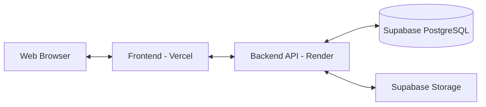

# Architecture (ARCHITECTURE.md)

ภาพรวมสถาปัตยกรรมของโปรเจกต์ Oracle Forms Repo

## 🏗 โครงสร้างสถาปัตยกรรม (High-Level Architecture)

## 📂 โครงสร้างโฟลเดอร์ (Folder Structure)

- `/frontend` - ระบบหน้าบ้าน (React + Vite)
  - `/src/components` - ชิ้นส่วน UI (Header, Sidebar, Modal ฯลฯ)
  - `/src/pages` - หน้าต่างๆ ของแอป (Repository, Audit Logs, ฯลฯ)
  - `/src/context` - React Context (AuthContext, AlertContext)
  - `/src/api` - ตั้งค่า Axios
  
- `/backend` - ระบบหลังบ้าน (Express + TypeScript)
  - `/src/controllers` - ควบคุม Logic (เช่น `fileController.ts`)
  - `/src/routes` - กำหนดเส้นทาง API Endpoint
  - `/src/services` - Service ย่อย (เช่น Notification, AuditLog)
  - `/src/config` - การเชื่อมต่อกับฐานข้อมูลภายนอก

## 🗄 โครงสร้างฐานข้อมูล (Database Schema)

- **`users`** (จัดการผ่าน Supabase Auth)
- **`systems`** - เก็บชื่อระบบ (เช่น ระบบบัญชี, ระบบบุคคล)
- **`file_types`** - เก็บประเภทไฟล์ที่อนุญาต
- **`files`** - เก็บข้อมูลมาสเตอร์ของไฟล์แต่ละชื่อ
- **`file_versions`** - เก็บเวอร์ชันของไฟล์ (เชื่อม 1-to-M กับ `files`)
- **`audit_logs`** - เก็บประวัติการกระทำ (ใคร ทำอะไร เมื่อไหร่)
- **`notifications`** - เก็บประวัติการแจ้งเตือน
